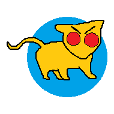

img2braille.m
=============

Because redrawing black and white images using Unicode Braille characters is... useful?

It's in Matlab code right now, it doesn't really need to be, so I should change it to something that's less Matlab.

What is...
----------
###character table.txt
Giant list of all 256 Unicode Braille characters, their names, and corresponding 8-bit binary represnetaion of their pattern.
The number of each dot in the Braille characters is as follows.

	[1] [4]
	[2] [5]
	[3] [6]
	[7] [8]

The binary and hex representations treat 1 as the MSB and 8 as LSB. For example, `⢭` would be represented by `0b10110101` or `0xB5`.
[This list](http://symbolcodes.tlt.psu.edu/bylanguage/braillechart.html) was very useful in making this part easy for me.

###test.png

A wonderful hand (MS Paint) crafted test image.

###test.png.html
[Sample output](./test.png.html "Still a beautiful image.") from test image.
